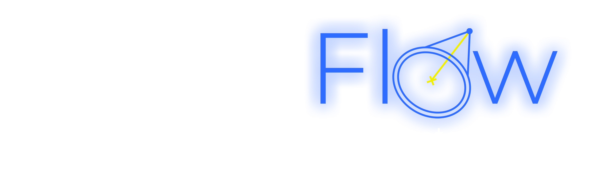

# LumiFlow

[](LICENSE)
[](https://www.blender.org)
[](https://github.com/sponsors/ProductViz)
[](https://discord.gg/zqrSFctH5s)

**LumiFlow** – Smart lighting addon for Blender.  
Free, open-source, and community-powered.

 

---

## 🌟 Features

### Smart Lighting System
- **Intelligent Light Placement**: Automatically position lights based on scene analysis
- **Smart Templates**: Pre-built lighting setups for various scenarios (Studio, Cinematic, Environment)
- **Interactive Positioning**: Real-time light manipulation with visual feedback
- **Camera-Aware Lighting**: Lights that adapt to camera positions and angles

### Positioning Tools
- Highlight, Normal, Target, Orbit, Free positioning modes
- **Flip Operations**: Mirror and rotate light setups quickly

### Template Library
- **Studio & Commercial**: Product and portrait setups
- **Dramatic & Cinematic**: Film, horror, action, romantic moods
- **Environment & Realistic**: Daylight, golden hour, night, weather-based
- **Utilities & Single Lights**: Quick rim/fill/key setups

### Visual Feedback System
- Real-time overlays for positioning
- Light path visualization
- Smart cursor feedback
- Camera overlays

### Smart Controls
- **Scroll Wheel Control**: Adjust distance, power, temperature, spread
- **Modal Operators**: Context-sensitive tools
- **Quick Actions** & **Batch Operations**

---

## 📋 Requirements
- Blender 4.2+ (Recommended: 4.5+)
- Windows, macOS, or Linux
- 4GB RAM minimum (8GB recommended)
- OpenGL 3.3 compatible GPU

---

## 🚀 Installation

### Method 1: From Release
1. Download the latest LumiFlow release (.zip file) from [GitHub Releases](https://github.com/ProductViz/LumiFlow/releases)
2. In Blender: `Edit > Preferences > Add-ons`
3. Click **Install...** and select the .zip file
4. Enable the addon by checking **LumiFlow**

### Method 2: Development Installation
1. Clone repo: `git clone https://github.com/ProductViz/LumiFlow`
2. In Blender Add-ons, click **Install...**
3. Select the cloned folder
4. Enable the addon

---

## 🎯 Getting Started

1. Enable LumiFlow from the **Sidebar Panel** in 3D View (N key → LumiFlow tab)  
2. Choose assignment mode (**Scene** or **Camera**)  
3. Add smart lights with **Shift+Q** pie menu  
4. Apply templates for quick setups  
5. Position lights interactively using tools or scroll controls  

### Key Shortcuts
- **Shift+Q**: Smart Light Pie Menu  
- **Scroll Wheel**: Adjust light properties  
- **G / R**: Move & Rotate lights (smart constraints)  
- **ESC**: Cancel operation  

---

## 🤝 Community & Support

Join the LumiFlow community:  
- [Discord Server]([https://discord.gg/yourlink](https://discord.gg/zqrSFctH5s)) – Real-time chat & Q&A  
- [GitHub Discussions](https://github.com/ProductViz/LumiFlow/discussions) – Feature requests & bug reports  
- [Blender Artists Forum](https://blenderartists.org/) – Showcase & discussions  

We also run **monthly lighting challenges**, **community showcases**, and **Q&A sessions**.

---

## 💖 Support Development

LumiFlow is free and open-source, but development takes time and effort.  
If LumiFlow helps your work, consider supporting its growth:

- [GitHub Sponsors](https://github.com/sponsors/ProductViz)  
- [Ko-fi](https://ko-fi.com/username)  
- [PayPal](https://paypal.me/username)  
- [Gumroad (Pay-What-You-Want)](https://gumroad.com/lumiflow)  
- [Patreon](https://patreon.com/username)  

**Sponsors get recognition, early access builds, and exclusive content.**

---

## 🛠️ Development

### Code Style
- PEP 8 guidelines, max line length 120 chars  
- Type hints & docstrings required  
- Tested on Blender 4.2+  

### Project Structure
```
LumiFlow/
├── __init__.py
├── core/
├── operators/
├── panels/
├── menus/
├── overlay/
├── templates/
├── assets/
└── docs/
```

### Contributing
1. Fork repo & create feature branch  
2. Follow code style guidelines  
3. Test on multiple Blender versions  
4. Submit PR with description & screenshots  

---

## 🎉 Roadmap

- [ ] More smart templates  
- [ ] Enhanced camera integration  
- [ ] Performance optimization  
- [ ] Community events integration  

Future versions will bring:  
✨ Advanced rendering integration  
✨ AI-assisted lighting suggestions  
✨ Studio workflow tools  

---

## 📄 License

GPL v3.0 – see [LICENSE](LICENSE)  
- ✅ Free for personal & commercial use  
- ✅ Modify & distribute  
- ❌ No warranty/liability  

---

## ❤️ Supporters (Simple List)

Thanks to everyone who has supported LumiFlow development:

- Alice
- Bob
- Charlie
- Your Name Here ✨

Want to join the list? [Support LumiFlow](https://github.com/sponsors/ProductViz)


## 🙏 Acknowledgments
- Blender Foundation for Blender  
- Community contributors & testers  
- Sponsors & supporters who make this possible  

---

**LumiFlow – Making professional lighting accessible to everyone.**  
