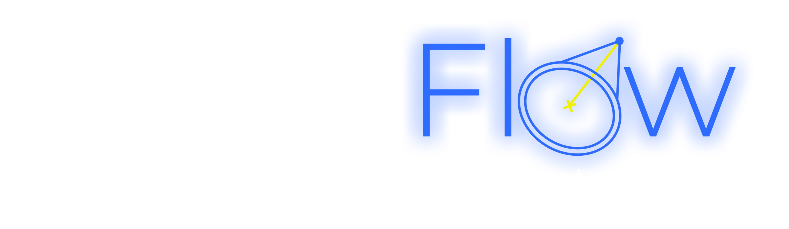

# LumiFlow

[](LICENSE)
[](https://www.blender.org)
[](https://github.com/sponsors/ProductViz)
[](https://ko-fi.com/productviz)
[](https://patreon.com/productviz)

**LumiFlow** – Smart lighting addon for Blender.  
Free, open-source, and community-powered.



---

## 🌟 Features

### Smart Lighting System
- **Intelligent Light Placement** — Automatically positions lights based on scene geometry and context.  
- **Smart Templates** — Ready-to-use setups for Studio & Commercial, Dramatic & Cinematic, Environment & Realistic, and Utilities & Single Lights lighting.  
- **Interactive Positioning** — Real-time manipulation with visual feedback in the viewport.  
- **Camera-Aware Lighting** — Lights dynamically adapt to the active camera.  

### Scene & Camera Assignment
- Assign lights globally or per-camera using organized naming conventions.  
- Automatically manage light visibility when switching between cameras.  

### Smart Light Addition
- **Smart Light & Template Menu (Ctrl+Shift+A)** — Open the LumiFlow lighting menu to add Blender lights (Sun, Point, Spot, Area) on the hovered mesh or apply Studio & Commercial, Dramatic & Cinematic, Environment & Realistic, and Utilities & Single Lights templates in one shortcut.  
- **Quick Smart Light (Ctrl+Shift+Right Mouse)** — Add a Rectangle Area Light directly on the hovered mesh using smart positioning, automatically aligned to the target object.  

### Smart Controls
- Control **Distance**, **Power**, **Size/Radius**, **Angle/Spread**, **Blend**, and **Temperature** with scroll gestures.  
- **Modal Operators** — Context-aware interaction tools.  
- **Quick Actions** — Perform fast, batch adjustments across multiple lights.  

### Positioning Tools
- Multiple positioning modes: **Highlight**, **Normal**, **Target**, **Orbit**, **Free**, and **Move**.  
- **Flip Operations** — Mirror or rotate entire light setups with one click.  

### Quick Light Linking
- Create object groups and manage light linking instantly.  
- Link lights to selected objects in one click.  

### Template Library
- **Studio & Commercial** — Perfect for product and portrait shots.  
- **Dramatic & Cinematic** — For storytelling moods: film, horror, action, romance.  
- **Environment & Realistic** — Includes daylight, golden hour, night, and weather-based setups.  
- **Utilities & Single Lights** — Quick setups for rim, fill, or key lighting.  

### Light Management
- **Solo Light** mode to isolate and preview a single light.  
- **Cycle Select** to iterate quickly through lights in your scene.  

### Visual Feedback System
- Real-time overlays for light position, direction, and intensity.  
- Interactive visualization for power, distance, and spread.  
- Smart cursor feedback and camera-based overlays.  

---

## 📋 Requirements
- Blender 4.2+ (Recommended: 4.5+)
- Windows, macOS, or Linux
- 4GB RAM minimum (8GB recommended)
- OpenGL 3.3 compatible GPU

---

## 🚀 Installation

### Method 1: From Release
1. Download the latest LumiFlow release (.zip file) from [GitHub Releases](https://github.com/ProductViz/LumiFlow/releases)
2. In Blender: `Edit > Preferences > Add-ons`
3. Click **Install...** and select the .zip file
4. Enable the addon by checking **LumiFlow**

### Method 2: Development Installation
1. Clone repo: `git clone https://github.com/ProductViz/LumiFlow`
2. In Blender Add-ons, click **Install...**
3. Select the cloned folder
4. Enable the addon

---

## 🎯 Getting Started

1. Enable LumiFlow from the **Sidebar Panel** in 3D View (N key → LumiFlow tab)  
2. Choose assignment mode (**Scene** or **Camera**)  
3. For individual lights, simply hover the target mesh and add smart lights with the **Ctrl+Shift+A** menu or **Quick Smart Light (Ctrl+Shift+Right Mouse)** – no selection required.  
4. For smart templates, first **select the product/object** you want to light, then use the same **Ctrl+Shift+A** menu to apply Studio & Commercial, Dramatic & Cinematic, Environment & Realistic, or Utilities & Single Lights setups.  
5. Adjust light properties (distance, power, size, angle, temperature, etc.) using smart controls (**modifier key + MMB drag**)  
6. Position lights interactively using positioning tools (**modifier key + LMB drag**)  

---

## 📚 Documentation

**Complete User Manual** available in the `user_manual/` folder:

👉 **[Start Here: User Manual Index](user_manual/00_INDEX.md)**

The manual includes:
- **Part 1:** Installation & Setup
- **Part 2:** Getting Started (5-minute Quick Start)
- **Part 3:** 40+ Template Library
- **Part 4:** Advanced Features (Positioning, Smart Controls, Light Linking)
- **Part 5:** Reference, FAQ, Troubleshooting

**Quick Links:**
- [Installation Guide](user_manual/01_Introduction_Installation.md#installation)
- [Quick Start (5 min)](user_manual/02_Getting_Started_Core_Features.md#quick-start-guide)
- [All Templates](user_manual/03_Template_Library.md)
- [Keyboard Shortcuts](user_manual/05_Reference_Support.md#complete-keyboard-shortcuts)
- [FAQ](user_manual/05_Reference_Support.md#frequently-asked-questions)

---

## 🤝 Community & Support

Join the LumiFlow community:  
- [Discord Server](https://discord.gg/Akav3KCRut) – Real-time chat & Q&A  
- [GitHub Discussions](https://github.com/ProductViz/LumiFlow/discussions) – Feature requests & bug reports  
- [Blender Artists Forum](https://blenderartists.org/) – Showcase & discussions  

We also run **monthly lighting challenges**, **community showcases**, and **Q&A sessions**.

---

## 💖 Support LumiFlow

LumiFlow is free and open-source — if you find it helpful, you can support ongoing development through any of the platforms below:

| Platform | Link | Description |
|-----------|------|-------------|
| 💜 **GitHub Sponsors** | [ProductViz](https://github.com/sponsors/ProductViz) | Official and most transparent way to support. |
| ☕ **Ko-fi** | [ko-fi.com/lumiflow](https://ko-fi.com/lumiflow) | One-time or monthly donation. |
| 🎨 **Patreon** | [patreon.com/lumiflow](https://patreon.com/LumiFlow) | Exclusive early builds and behind-the-scenes updates. |
| 📦 **Gumroad** | [gumroad.com/lumiflow](https://lumiflow.gumroad.com/l/xhzmmr) | Pay-what-you-want downloads and supporter bundles. |

**Sponsors receive:**
- Early access to development builds  
- Recognition in documentation (if they opt in)  
- Access to the community feedback channel on Discord  

See all supporters → [Supporters List](docs/donate.md)

---

## 🛠️ Development

### Code Style
- PEP 8 guidelines, max line length 120 chars  
- Type hints & docstrings required  
- Tested on Blender 4.2+  

### Project Structure
```
LumiFlow/
├── __init__.py
├── base_modal.py
├── preferences.py
├── registration.py
│
├── core/          # Core systems and state management
├── operators/     # Operator classes for interactive lighting tools
├── ui/            # Panels, pie menus, and interface layouts
├── utils/         # Utility functions and light calculation helpers
├── assets/        # Icons, logos, and other assets
│
├── LICENSE
└── README.md
```

### Contributing
1. Fork repo & create feature branch  
2. Follow code style guidelines  
3. Test on multiple Blender versions  
4. Submit PR with description & screenshots  

---

## 📄 License

GPL v3.0 – see [LICENSE](LICENSE)  
- ✅ Free for personal & commercial use  
- ✅ Modify & distribute  
- ❌ No warranty/liability  

---

## 🙏 Acknowledgments
- Blender Foundation for Blender  
- Community contributors & testers  
- Sponsors & supporters who make this possible  

---

**LumiFlow – Making professional lighting accessible to everyone.**

